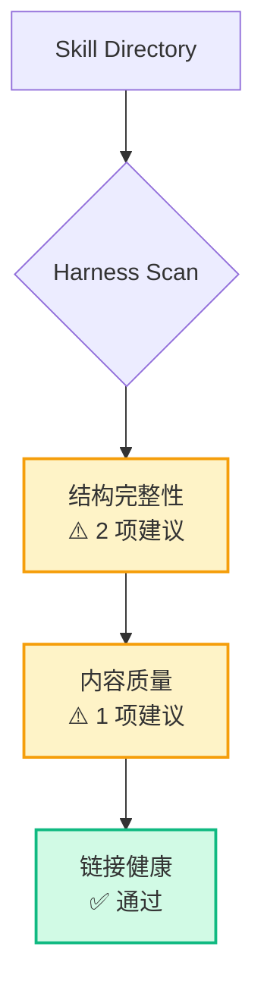

# Skill Doctor 健康报告

> 扫描时间: 2026-04-07T13:19:17.570075
> 目标 Skill: musk-perspective
> 路径: C:\Users\Administrator\skills\musk-perspective

## 评分摘要

**综合得分**: 7/10 (70%)

| 状态 | 含义 |
|------|------|
| ✅ | 通过 |
| ❌ | 必填项未通过（需要修复） |
| ⚠️ | 可选项未通过（建议完善） |

## 详细检查结果

### 结构完整性
*检查 SKILL.md 和必要的目录结构是否存在且完整*

- ✅ **SKILL.md** (skill-md): 存在: SKILL.md
- ✅ **Frontmatter 完整** (frontmatter): 匹配 3/3 个正则
- ⚠️ **References 目录** (references-dir): 缺失: references
- ⚠️ **Research 文件集** (research-files): 目录不存在: references\research

### 内容质量
*检查 SKILL.md 中是否包含必要的章节和表达规范*

- ✅ **角色扮演规则** (role-rules): 找到章节: ##? 角色扮演规则|##? 使用说明|##? Usage|##? How to use
- ✅ **心智模型章节** (mental-models): 找到章节: ##? 核心心智模型|##? 心智模型
- ✅ **诚实边界** (honesty-boundary): 找到章节: ##? 诚实边界|##? 局限性|##? 边界|##? Limitations|##? Caveats|##? Known Issues|##? 免责声明
- ⚠️ **引用规范（KB类 skill）** (citation-discipline): 匹配 0/2 个正则
- ✅ **心智模型数量** (model-count): 实际 5 个，要求 [3, 7]

### 链接健康
*检查内部链接是否指向存在的本地文件*

- ✅ **内部链接可解析** (internal-links): 发现 0 个失效内部链接

## 治理循环图

## 建议行动

- 完善 **References 目录** (references-dir): 缺失: references
- 完善 **Research 文件集** (research-files): 目录不存在: references\research
- 完善 **引用规范（KB类 skill）** (citation-discipline): 匹配 0/2 个正则

- → 如需 redesign 指导，参考 `software-design-philosophy` skill。
